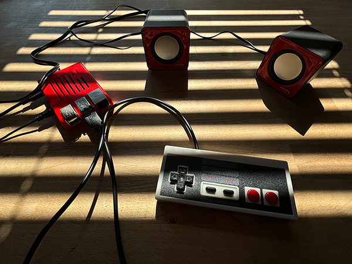

# Pi radio

A Python (Raspberry Pi) script to control online radio streaming with a gamepad. Switch between stations, adjust volume, and manage playback using gamepad buttons.

- [Hardware](#hardware)
- [Getting started](#getting-started)
- [Run script](#run-script)
- [Update](#update)

## Hardware

- Raspberry Pi; I use a Pi 4 but any Pi will probably do just fine. Just keep in mind that some models don't have a mini jack (including Pi 5) and normal USB ports. 
- PC speakers; I use cheap PC speakers with a mini jack for audio and USB for power (https://www.bol.com/nl/nl/p/compacte-stereo-luidsprekers-audiocore-ac870-pc-speakers/9200000099727061/) but you can use whatever you like.
- Gamepad; I use a NES style USB gamepad. Something like https://www.amazon.com/Controller-suily-Joystick-RetroPie-Emulators/dp/B07M7SYX11 (They don't have them anymore where I bought them). But any gamepad will do. You might need to change the event types and event codes in `process_event` though.
- Power supply for the Pi
- Power supply for the PC speakers; I recommend using a separate power supply for the PC speakers, as I noticed powering them through one of the USB ports on the Pi resulted in more audio stuttering
- Optional: Case for the Pi; I've used https://www.thingiverse.com/thing:3975417 but you can use any case you want

## Getting started

## Install

1. Install Raspberry Pi OS on a SD card. You can easily choose the right image and setup a username / password, Wi-Fi and enable SSH with the [Raspberry Pi OS imager](https://www.raspberrypi.com/software/). I've used the latest recommended image `Raspberry Pi OS (64-bit) - Release date 2024-07-04 - A port of Debian Bookworm with the Raspberry Pi Desktop` in the example below, but I recommend just installing the latest recommended version.
2. Boot the Pi (might take a while depending on which Pi you're using)
3. Connect via SSH `ssh <your-pi-username>@<your-pi-ip>`
4. Clone repository `git clone https://github.com/rickvanderwolk/pi-radio.git`
5. Run install script `bash pi-radio/install.sh` (might take a while)
6. [Run script](#run-script)

### Start script on boot (optional)

1. `crontab -e`
2. Choose nano by pressing `1` + `enter`
3. Add to following line `@reboot sleep 30 && bash pi-radio/start_radio.sh >> /home/<your-pi-username>/pi-radio/cron.log 2>&1`
4. Press `ctrl` + `x` and then `y` to save
5. Reboot `sudo reboot`

## Run script

Run script `bash start_radio.sh`.

## Update

If you're using an old version of this project and the repository has been updated since, use instructions below to update.

1. Update project `bash pi-radio/update.sh`
2. Check if new config options are available `diff -y pi-radio/.env.example pi-radio/.env`. Add new config options if needed with `nano pi-radio/.env`.  Press `ctrl` + `x` and then `y` to save.
3. Restart script or Pi
